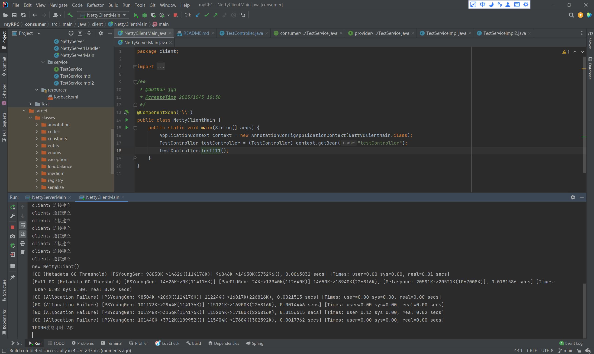

# Introduction

通过对Netty的学习，基于Netty、Spring、Zookeeper实现了轻量级RPC框架。

# Feature

- [x] 使用Netty（基于NIO）替代BIO实现网络传输；
- [x] 支持长连接，通过复用Channel避免重复连接服务端；
- [x] 支持Kryo和JSON序列化；
- [x] 支持心跳检测，确保客户端和服务端连接的可用性；
- [ ] 支持随机负载均衡算法，一致性哈希算法待补充；
- [x] 客户端和服务端通信协议的重新设计，减小消息包大小，提高网络传输性能：
  - [ ] （待补充）魔数
  - [x] 消息总长度
  - [x] 消息包类型
  - [x] 序列化器类型
  - [ ] （待补充）压缩类型
  - [x] 消息ID
  - [x] 消息体
- [x] 根据重新设计的通信协议，基于长度域解码器实现了TCP拆包粘包现象的避免；
- [x] 基于Zookeeper实现服务注册中心，支持客户端的服务监听和服务发现功能，支持服务端的服务注册功能；
- [x] 支持客户端服务节点列表的动态管理；
- [x] 接近零配置，集成spring，基于注解来注册和消费服务；
- [ ] （待实现）服务监控中心（类似dubbo admin），根据监控中心记录的信息可以设计一个新的负载均衡策略，提高rpc框架的性能；
- [ ] （待实现）采用SPI机制，目前以硬编码的方式设置序列化器或者注册中心，后续研究如何使用配置文件来设置序列化器或者注册中心等，提高rpc框架的易用性

# Quick Start

## 1.启动Zookeeper服务器

点开`zkServer.cmd`即可。

## 2.安装依赖

导入maven，相关相关依赖。

## 3.启动服务器

### 添加服务

在provider/service下添加服务端可提供的服务接口和相应的实现类，并给实现类加上@Remote注解：

服务接口：provider/src/main/java/service/TestService.java

```java
public interface TestService {
    public String test(Test test);
}
```

实现类：provider/src/main/java/service/TestServiceImpl2.java

```java
@Remote
@Component
public class TestServiceImpl2 implements TestService {

    static {
        System.out.println("TestServiceImpl2被创建");
    }
    
    @Override
    public String test(Test test) {
        log.info("TestServiceImpl2.test被调用");
        log.info("Test message is: {}", test.getMessage());
        log.info("Test description is: {}", test.getDescription());
        String result = "来自服务器的问候——你好2";
        log.info("TestServiceImpl2返回: {}.", result);
        return result;
    }
}
```

### 启动服务器

provider/src/main/java/server/NettyServerMain.java

```java
@ComponentScan("\\")
public class NettyServerMain {
    public static void main(String[] args) {
        ApplicationContext context = new AnnotationConfigApplicationContext(NettyServerMain.class);
    }
}
```

## 4.启动客户端

### 可用服务

根据服务端提供的服务，生成相应的接口：

consumer/src/main/java/service/TestService.java

```java
public interface TestService {
    public String test(Test test);
}
```

在要调用的地方生成接口形式的属性，为该属性添加@RemoteInvoke注解：

consumer/src/main/java/service/TestController.java

```java
@Component
public class TestController {
    
    @RemoteInvoke
    private TestService testService;
    
    public void test111() {      
        ExecutorService executor = Executors.newFixedThreadPool(RpcConstants.CHANNEL_SIZE);
        // 性能测试
        int times = 100000;
        CountDownLatch countDownLatch = new CountDownLatch(times);
        Long start = System.currentTimeMillis();
        for(int i=1;i<=times;i++){
            int j = i;
            executor.execute(new Runnable() {
                @Override
                public void run() {
                    testService.test(new Test("你好", "问候语"));
                    countDownLatch.countDown();
                }
            });
        }
        try {
            countDownLatch.await();
        } catch (InterruptedException e) {
            e.printStackTrace();
        }
        Long end = System.currentTimeMillis();
        Long count = end-start;
        System.out.println(times + "次总计时:"+count/1000+"秒");
    }
    
}
```

### 使用服务

启动客户端：

consumer/src/main/java/client/NettyClientMain.java

```java
@ComponentScan("\\")
public class NettyClientMain {
    public static void main(String[] args) {
        ApplicationContext context = new AnnotationConfigApplicationContext(NettyClientMain.class);
        TestController testController = (TestController) context.getBean("testController");
        testController.test111();
    }
}
```

## 5.调用结果

本机是处理器AMD R7 5800H 3.20 GHz，24gb，8核（支持超线程）的笔记本。

### 一万次调用

耗时7秒



### 十万次调用

耗时18秒


### 一百万次调用

耗时120s


# Overview

项目架构图：


# Reference

参考：

[Yinsiyuan/Yin.RPC: My Dream RPC. (github.com)](https://github.com/Yinsiyuan/Yin.RPC)

[Snailclimb/guide-rpc-framework: A custom RPC framework implemented by Netty+Kyro+Zookeeper.（一款基于 Netty+Kyro+Zookeeper 实现的自定义 RPC 框架-附详细实现过程和相关教程。） (github.com)](https://github.com/Snailclimb/guide-rpc-framework)
